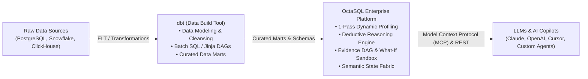

<div align="center">

# 🌌 OctaSQL
### Deterministic Deductive Analytics Engine for Enterprise DWH

[](https://martystev.github.io/octasql-landing/)
[](https://martystev.github.io/octasql-landing/)
[](https://martystev.github.io/octasql-landing/)
[](https://martystev.github.io/octasql-landing/)

<p align="center">
  <b>Overcome the Text-to-SQL crisis. Deterministic deductive intelligence for enterprise data warehouses.</b><br>
  Native support for 8 DBMS engines • Factor Analysis (Shapley Values) • AST SQL Sandbox • Data Isolation
</p>

[**🌐 Open Interactive Website (Live Demo) →**](https://martystev.github.io/octasql-landing/)

---

</div>

## 🚀 About OctaSQL

**OctaSQL** is a next-generation enterprise deterministic deductive analytics platform built to eliminate generative AI hallucinations when working with enterprise data warehouses (DWH).

Unlike standard Text-to-SQL libraries (such as LangChain or LlamaIndex) that feed raw DDL schemas directly into LLMs, **OctaSQL isolates computations within a closed mathematical perimeter**:
- **LLM Orchestrator**: Solely responsible for formulating deductive hypotheses in natural language.
- **OctaSQL Core**: Proprietary core autonomously verifies security, resolves entities via a deterministic semantic graph, and decomposes metric deviations into exact contributing factors without exposing raw data.

---

## 📊 Comparison: Baseline Text-to-SQL vs. OctaSQL Platform

| Business Query Class | Baseline Text-to-SQL (LangChain / LlamaIndex / Generic AI) | OctaSQL Enterprise Platform |
| :--- | :--- | :--- |
| **🔍 Diagnostic Analysis**<br>*(“Why did revenue drop by 14% in Q3?”)* | ❌ **Not supported.** Outputs only a single flat number without identifying underlying root causes. | ✅ **Proprietary Causal Engine™.** Automatically isolates hidden anomalies and decomposes metric deltas into exact factor contributions. |
| **🔗 Complex Ad-Hoc Joins**<br>*(10+ tables, nested CTEs, groupings)* | ⚠️ **High error rate (40–60%).** Incorrectly joins unrelated tables based on similar column names. | ✅ **Deterministic Semantic Graph.** Guarantees strict relation topology and 99.8% aggregate accuracy. |
| **📈 What-If Scenario Modeling**<br>*(“What happens to margin if prices increase by 5%?”)* | ❌ **Not applicable.** Can only query historical snapshots "as is". | ✅ **Built-in Simulation Module.** Simulates business system response in an isolated sandbox accounting for elasticity. |
| **⚡ Token & Context Consumption**<br>*(LLM inference cost savings)* | ❌ **50,000 – 120,000+ tokens / query.** Dumps complete DDLs of hundreds of tables into every prompt, overloading context. | ✅ **Up to 95% reduction (800–2,000 tokens).** Proprietary context layer isolates the exact relevant schema subgraph. |
| **🛡 Security & Data Integrity**<br>*(Protection against injections, DROP/UPDATE)* | ⚠️ **Risk of data corruption.** Prompt injections can trigger destructive operations. | ✅ **Multi-level Security Filter.** Hardware-guaranteed Read-Only perimeter prior to executing queries against the DBMS. |
| **🔒 Data Privacy & Compliance**<br>*(GDPR, HIPAA, Banking Secrecy, Data Protection)* | ❌ **Leaks to external APIs.** Schemas and sample data rows are sent to external third-party cloud services. | ✅ **100% On-Premise & Air-Gapped.** Complete isolation within your enterprise security boundary. Zero raw row export. |

```
                      ┌─────────────────────────────────────────┐
                      │          User Business Query            │
                      │  "Why did revenue in Siberia drop 14%?" │
                      └────────────────────┬────────────────────┘
                                           │
                                           ▼
┌────────────────────────────────────────────────────────────────────────────────────────┐
│                                   OCTASQL CORE                                         │
│                                                                                        │
│  [ 1. Hybrid BM25 Index ] ──► [ 2. DuckDB State Fabric ] ──► [ 3. Deductive Planner ]   │
│         (Schemas + Synonyms)          (Local State Layer)          (Hypothesis Gen)    │
│                                                                          │             │
│                                                                          ▼             │
│  [ 6. Shapley Attribution ] ◄── [ 5. Exec in Engine ] ◄── [ 4. AST Security Sandbox ]  │
│      (Delta Decomposition)        (Postgres / ClickHouse)      (Read-Only Guarantees)  │
└──────────────────────────────────────────┬─────────────────────────────────────────────┘
                                           │
                                           ▼
                      ┌─────────────────────────────────────────┐
                      │    Deterministic Factor Report          │
                      │  • Logistics: -68.4% (-$2.34M)          │
                      │  • Discount:  -21.1% (-$0.72M)          │
                      └─────────────────────────────────────────┘
```

---

## 🔄 Relationship to dbt & Modern Data Stack

A frequent enterprise evaluation question: **"We already have dbt in our data stack — why do we need OctaSQL?"**

**They solve fundamentally different layers of the modern data stack and work together synergistically:**



| Dimension | **dbt (data build tool)** | **OctaSQL Enterprise Platform** |
| :--- | :--- | :--- |
| **Core Mission** | **Data Transformation (T in ELT):** cleans, transforms, and organizes raw warehouse data into curated tables. | **LLM-Native Reasoning & Execution:** provides AI agents with an auditable, deterministic reasoning runtime over structured data. |
| **Primary User** | Analytics Engineers, Data Engineers (writing SQL/YAML). | AI Agents, Copilots, Decision Makers, Business Analysts. |
| **Execution Model** | Scheduled batch execution (building static tables/views in DWH). | Interactive, JIT (Just-in-Time) query execution, dynamic schema compression, and in-memory OLAP state cells. |
| **Reasoning & Causality** | Static metric definitions (MetricFlow / Semantic Layer). | **Proprietary Causal Reasoning Engine™**: automated hypothesis generation, multi-dimensional root-cause attribution, statistical bias & anomaly isolation, and scenario modeling (What-If simulations). |
| **AI Integration** | None natively (requires third-party Text-to-SQL or semantic layer connectors). | Native **Model Context Protocol (MCP)** server, REST API, and deterministic `planned` SQL mode (zero hallucinations). |

> **Enterprise Takeaway:** If your organization already uses dbt, deploying OctaSQL is even faster. OctaSQL directly inspects your curated dbt marts, turning static warehouse models into an interactive, reasoning-capable AI knowledge fabric without hallucinations or risky ad-hoc SQL.

---

## ⚡ Key Capabilities

| Feature | Description |
| :--- | :--- |
| **🛡 Zero-Hallucination** | Dual security sandbox and AST validator guarantee 100% Read-Only execution with no destructive operations or phantom joins. |
| **📊 Shapley Factor Analysis** | Mathematical decomposition of variances: exact calculation of each factor's contribution (price, logistics, demand) to the net metric change. |
| **🗄 Native Support for 8 DBMS Engines** | PostgreSQL, ClickHouse, Greenplum (MPP), Snowflake, Google BigQuery, DuckDB/Parquet, MySQL/MariaDB, MS SQL Server. |
| **⚡ DuckDB Semantic State Fabric** | Stores aggregated metadata and quantiles in a local columnar layer delivering sub-millisecond response times. |
| **🔌 Model Context Protocol (MCP)** | Native JSON-RPC 2.0 server for integrating the engine as a tool in **Claude Desktop**, **Cursor IDE**, and autonomous agents. |
| **🔒 100% Air-Gapped & Safe** | Runs in isolated on-premise environments without internet access using local LLMs (vLLM / Ollama). Raw data never leaves the perimeter. |
| **🔑 Cryptographic Licensing** | Offline HMAC-SHA256 license verification with hardware node-locking (Node Fingerprint). |

---

## 🖥 Supported Data Warehouses & Engines (8 DBMS)

```
┌──────────────┬──────────────┬──────────────┬──────────────┐
│  PostgreSQL  │  ClickHouse  │  Greenplum   │  Snowflake   │
├──────────────┼──────────────┼──────────────┼──────────────┤
│   BigQuery   │    DuckDB    │ MySQL/Maria  │    MS SQL    │
└──────────────┴──────────────┴──────────────┴──────────────┘
```

---

## 🔌 Integration with Claude Desktop & Cursor (MCP)

Add the following configuration to your `claude_desktop_config.json`:

```json
{
  "mcpServers": {
    "octasql": {
      "command": "docker",
      "args": ["exec", "-i", "octasql-server", "octasql", "mcp"],
      "env": {
        "OCTASQL_LICENSE_KEY": "OCTASQL-eyJhbGciOiJIUzI1NiIsInR5cCI6IkpXVCJ9..."
      }
    }
  }
}
```

---

## 📄 Commercial Licensing, Documentation & Roadmap

**OctaSQL Engine** is distributed under a **Commercial On-Premise / Enterprise Subscription** model with offline cryptographic node-locking (Air-Gapped).

- 🗺️ **[Future Features Roadmap](https://github.com/MartyStev/octasql-landing/blob/main/docs/FUTURE_FEATURES_ROADMAP.md)**: Detailed roadmap for Dynamic PII Masking Vault, Differential Privacy, RBAC AST-Injection, SIEM Merkle-Audit, and Web Copilot UI.
- 📘 **[Operational Guide & Architecture Whitepaper](https://github.com/MartyStev/octasql-landing)**

To request an enterprise license key or discuss pilot integration:
👉 **[Request an On-Premise Access Key on the Official Website →](https://martystev.github.io/octasql-landing/)**

<div align="center">
  <sub>© 2026 OctaSQL Engine. All rights reserved. Enterprise Deductive Analytics.</sub>
</div>
